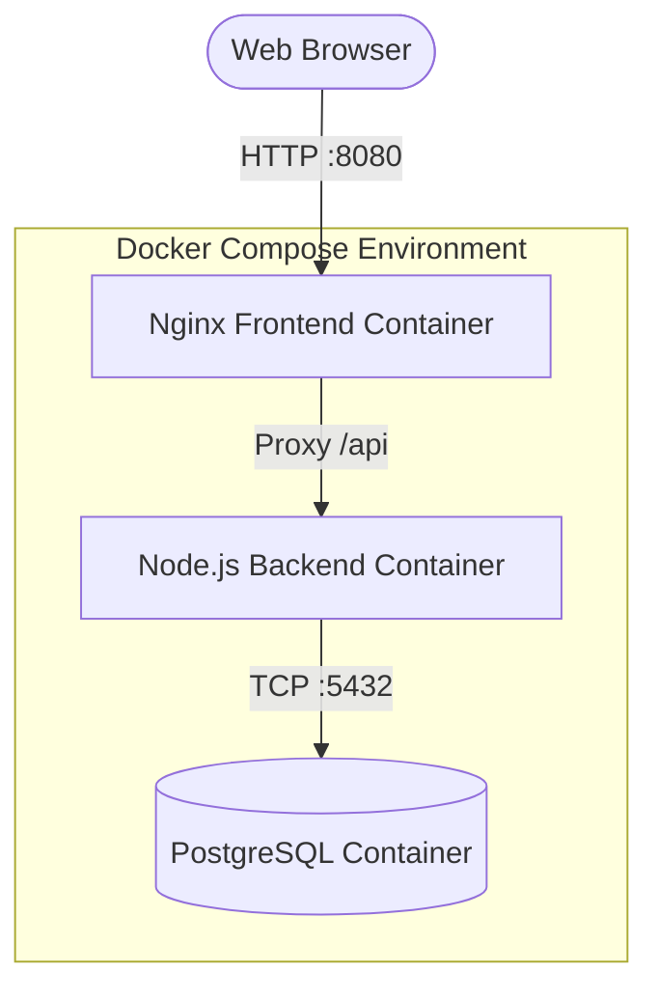
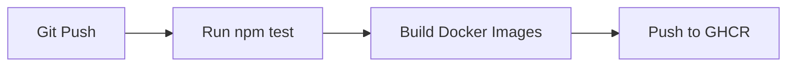

# 🚀 Zero-Cost Microservices CI/CD Pipeline

This repository demonstrates a complete, end-to-end DevOps pipeline for a containerized 3-tier microservice application using entirely free and open-source tooling (GitHub Actions, Docker, GitHub Container Registry).

## 🏗️ Architecture

Below is the infrastructure footprint. The application runs a React-like HTML/JS frontend served by **Nginx**, a **Node.js/Express** backend API, and a **PostgreSQL** database.



## ⚙️ CI/CD Pipeline (GitHub Actions)

When code is pushed to the `main` branch, the following automated pipeline triggers:

1. **Test Stage**: Provisions an Ubuntu runner, installs Node.js dependencies, and executes unit tests for the backend API.
2. **Build Stage**: Compiles multi-stage `Dockerfile` configurations for both the Frontend and Backend.
3. **Push Stage**: Authenticates with GitHub Container Registry (GHCR) and securely publishes the newly versioned images.



## 👨‍💻 "One-Click" Local Deployment for Recruiters

To run this entire stack locally on your machine, you **do not** need to install Node/Python/Postgres. You only need Docker.

**1. Clone the repository:**
```bash
git clone <your-repo-url>
cd <your-repo-folder>
```

**2. Start the infrastructure:**
```bash
docker-compose up -d
```

**3. Test the application:**
Open your browser and navigate to: [http://localhost:8080](http://localhost:8080). 
You will see the operational dashboard querying the Node.js API and Postgres Database in real-time.

**4. Teardown:**
```bash
docker-compose down
```
